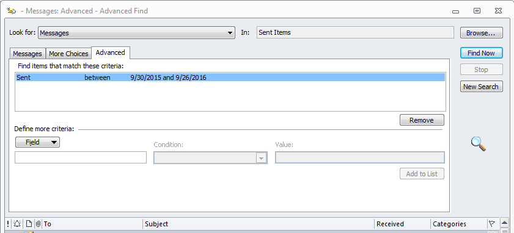

```{r setup, include=FALSE}
knitr::opts_chunk$set(echo = TRUE)
```

# Purpose

Every year in September I am asked by my manager for information that he can use for my performance evaluation. One of the items is a list of three people with whom I have worked over the last year. Sometimes this is easy since I've had some well-defined projects with easily identified collaborators. But this year I really couldn't bring more than one person to mind.

So I decided to mine my Outlook account for this information, specifically my "Sent" folder. This is because I receive all kinds of email that is only tangentially related to my projects but the people that I send emails to are most likely to be collaborators on a project.

## First get libraries setup

```{r libraries, message=FALSE}
library(readr)
library(dplyr)
```

## Acquire the data

So I opened up Outlook and opened up the Advanced Find dialog window, selected the "Sent" folder and chose the Sent field to be between 9/30/2015 and 9/30/2016.



I then selected all records returned (Ctl-A), copied them to the clipboard (Ctl-C), and then pasted the records into a text editor (Ctl-V) - I use Notepad+ in Windows.


